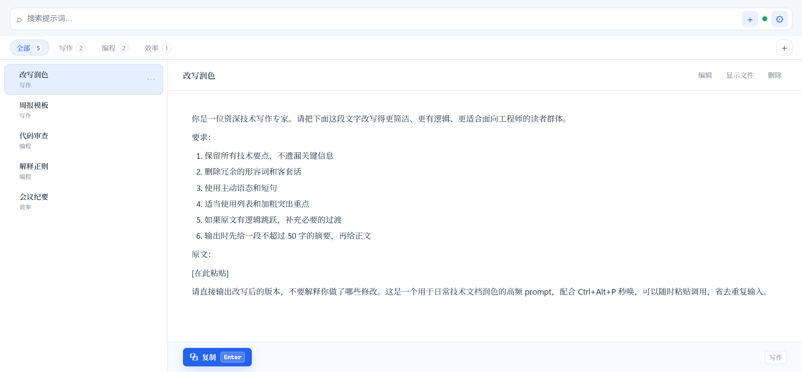

# Prompt Pocket

<p align="center">
  
</p>

<p align="center">
  <a href="https://github.com/techdou/prompt-pocket/releases/latest">
    
  </a>
  <a href="LICENSE">
    
  </a>
  
  
  <a href="https://github.com/techdou/prompt-pocket/actions/workflows/ci.yml">
    
  </a>
</p>

<p align="center">
  <a href="#简体中文">简体中文</a>
  ·
  <a href="#english">English</a>
  ·
  <a href="https://techdou.github.io/prompt-pocket/">Website</a>
  ·
  <a href="https://github.com/techdou/prompt-pocket/releases/latest">Download</a>
</p>

Prompt Pocket is a lightweight desktop prompt manager. It opens from anywhere with `Ctrl+Alt+P`, stores prompts as local Markdown files, and can manually sync through Jianguoyun WebDAV.

Prompt Pocket 是一个轻量级桌面提示词管理工具。它用 `Ctrl+Alt+P` 从任意应用快速唤出，以本地 Markdown 文件保存提示词，并支持通过坚果云 WebDAV 手动同步。

---

## 简体中文

### 功能特性

| 功能 | 说明 |
| --- | --- |
| 全局秒唤 | `Ctrl+Alt+P` 从任意应用唤出或隐藏 |
| 智能复制 / 粘贴 | `Enter` 写入剪贴板；唤出前焦点在输入框时自动粘贴 |
| Markdown 存储 | 一条提示词一个 `.md` 文件，文件夹就是分类 |
| 富 Markdown 预览 | 支持 GFM 表格、任务列表、代码块；Mermaid、KaTeX、highlight.js 按需加载 |
| 提示词排序 | 在单个分类里拖动列表项手柄，顺序写入 `.order.json` |
| 分类排序 | 横向拖动分类标签手柄，顺序写入 `.category-order.json` |
| 手动 WebDAV 同步 | 通过坚果云上传 / 下载，避免自动同步误覆盖 |
| 安全凭据存储 | WebDAV 应用密码保存到系统凭据库，不写入明文 JSON |
| 轻量桌面壳 | Tauri v2 + Rust 后端，不使用 Electron |

### 下载安装

从 [GitHub Releases](https://github.com/techdou/prompt-pocket/releases/latest) 下载最新版 `v2.0.3`。三平台 CI 全绿，安装包均由 GitHub Actions 构建。

| 平台 | 文件 | 链接 |
| --- | --- | --- |
| macOS Apple Silicon | `Prompt.Pocket_2.0.3_aarch64.dmg` | [v2.0.3 最新 Release](https://github.com/techdou/prompt-pocket/releases/latest) |
| Windows x64 | `Prompt.Pocket_2.0.3_x64-setup.exe` | [v2.0.3 最新 Release](https://github.com/techdou/prompt-pocket/releases/latest) |
| Windows x64 | `Prompt.Pocket_2.0.3_x64_en-US.msi` | [v2.0.3 最新 Release](https://github.com/techdou/prompt-pocket/releases/latest) |

首次启动会显示主窗口；之后默认隐藏到后台，可用快捷键或托盘打开。

### 快速开始

1. 在任意应用的输入框里放好光标。
2. 按 `Ctrl+Alt+P` 唤出 Prompt Pocket。
3. 搜索或用方向键选中提示词。
4. 按 `Enter`。

如果唤出前焦点在输入框，Prompt Pocket 会写入剪贴板并自动粘贴回原输入框；否则只写入剪贴板，不模拟粘贴。

### 快捷键

| 操作 | 快捷键 |
| --- | --- |
| 全局唤出 / 隐藏 | `Ctrl+Alt+P` |
| 新建提示词 | `Ctrl+N` |
| 聚焦搜索框 | `Ctrl+F` |
| 上下选择 | `↑` / `↓` |
| 复制选中项 | `Enter` |
| 隐藏窗口 | `Esc` |

### 数据结构

默认数据目录：

```text
Windows: %APPDATA%/com.promptpocket.app/PromptPocket/
macOS:   ~/Library/Application Support/com.promptpocket.app/PromptPocket/
Linux:   ~/.config/com.promptpocket.app/PromptPocket/
```

目录示例：

```text
PromptPocket/
├── 写作/
│   ├── 改写润色.md
│   └── 周报模板.md
├── 编程/
│   └── 代码审查.md
├── .order.json          # 每个分类内的提示词排序
└── .category-order.json # 分类排序
```

提示词文件格式：

```markdown
---
title: 改写润色
copy_mode: markdown
created: 2026-06-27T00:00:00Z
updated: 2026-06-27T00:00:00Z
---

请把下面这段文字改写得更简洁、专业：

> 待改写内容
```

### 拖拽排序

- 提示词排序只在单个分类视图可用；搜索结果和多分类「全部」视图会禁用排序。
- 分类排序中「全部」固定首位不可拖；其他分类可横向重排。
- 前端先乐观更新，再调用 Rust 后端写入排序 JSON。
- 排序写盘期间如果同步完成触发刷新，会延迟到写盘后再刷新，避免顺序被旧文件冲掉。

### Markdown 预览

- 离线内置 GitHub Flavored Markdown（GFM），包括表格、引用、删除线、任务列表、代码块。
- 联网增强按需加载 Mermaid、KaTeX、highlight.js。
- raw HTML 一律转义显示，危险链接会替换为 `#`。
- CDN 加载失败时降级显示源码，不影响核心阅读和复制。

### 坚果云同步

1. 登录坚果云。
2. 打开「账户信息 → 安全选项 → 第三方应用管理」。
3. 添加应用并生成应用密码。
4. 在 Prompt Pocket 设置中填写账号、应用密码和远程目录。
5. 选择「上传到坚果云」或「下载到本地」。

同步规则：

- 上传：把本地提示词推送到云端，不删除云端已有文件。
- 下载：以云端为准拉取到本地，并清理云端已删除的本地文件。
- `.trash`、隐藏目录和 `.sync_meta.json` 会被过滤。
- 应用密码保存到系统凭据库；旧版本明文 JSON 中的密码会在读取时迁移出去。

### 开发

前置依赖：

- Node.js 18+
- Rust 1.77+
- Tauri v2 平台工具链：<https://v2.tauri.app/start/prerequisites/>

```bash
npm install
npm run tauri:dev
npm run tauri:build
```

### 验证

```bash
node --experimental-strip-types --test src/lib/*.test.mjs
npm run build
cargo test --manifest-path src-tauri/Cargo.toml
cargo clippy --manifest-path src-tauri/Cargo.toml --all-targets -- -D warnings
npm run tauri:build
```

### 发布

- GitHub Release：按平台上传 macOS 包、Windows 安装包、MSI 和便携版可执行文件。
- GitHub Pages：落地页位于 `docs/index.html`，截图资源位于 `docs/screenshots/`。
- Pages 配置为 `main` 分支的 `/docs` 目录；推送到 `main` 后按仓库配置重新发布。

本地预览落地页：

```bash
cd docs
python -m http.server 8010
```

### 技术栈

| 层 | 技术 |
| --- | --- |
| 桌面壳 | Tauri v2 |
| 后端 | Rust |
| 前端 | Svelte 5 + Vite + TypeScript |
| Markdown | marked + marked-highlight |
| 富内容增强 | Mermaid / KaTeX / highlight.js CDN 按需加载 |
| 快捷键 | tauri-plugin-global-shortcut |
| 剪贴板 | tauri-plugin-clipboard-manager |
| 托盘 | Tauri tray icon |
| 单实例 | tauri-plugin-single-instance |
| 凭据存储 | keyring + 系统凭据库 |
| 云同步 | reqwest_dav + 坚果云 WebDAV |
| 数据格式 | Markdown + YAML frontmatter |

---

## English

### Features

| Feature | Description |
| --- | --- |
| Global launcher | Open or hide Prompt Pocket from anywhere with `Ctrl+Alt+P` |
| Smart copy / paste | Press `Enter` to copy; automatically paste back when launched from a text input |
| Markdown storage | One prompt per `.md` file; folders are categories |
| Rich Markdown preview | GFM tables, task lists, code blocks; Mermaid, KaTeX, and highlight.js load on demand |
| Prompt ordering | Drag prompt handles within one category; order is saved to `.order.json` |
| Category ordering | Drag category tabs horizontally; order is saved to `.category-order.json` |
| Manual WebDAV sync | Upload / download through Jianguoyun WebDAV to avoid accidental overwrite |
| Secure credentials | WebDAV app passwords are stored in the system credential store, not plaintext JSON |
| Lightweight shell | Tauri v2 + Rust backend, no Electron |

### Download

Download the latest `v2.0.3` from [GitHub Releases](https://github.com/techdou/prompt-pocket/releases/latest). All three platforms pass CI, and installers are built by GitHub Actions.

| Platform | File | Link |
| --- | --- | --- |
| macOS Apple Silicon | `Prompt.Pocket_2.0.3_aarch64.dmg` | [v2.0.3 latest Release](https://github.com/techdou/prompt-pocket/releases/latest) |
| Windows x64 | `Prompt.Pocket_2.0.3_x64-setup.exe` | [v2.0.3 latest Release](https://github.com/techdou/prompt-pocket/releases/latest) |
| Windows x64 | `Prompt.Pocket_2.0.3_x64_en-US.msi` | [v2.0.3 latest Release](https://github.com/techdou/prompt-pocket/releases/latest) |

The first launch shows the main window. Later launches stay in the background and can be opened through the hotkey or tray icon.

### Quick Start

1. Put the caret in any text input.
2. Press `Ctrl+Alt+P` to open Prompt Pocket.
3. Search or use arrow keys to select a prompt.
4. Press `Enter`.

If Prompt Pocket was opened from a text input, it copies the prompt and pastes it back automatically. Otherwise it only writes to the clipboard.

### Keyboard Shortcuts

| Action | Shortcut |
| --- | --- |
| Open / hide globally | `Ctrl+Alt+P` |
| Create prompt | `Ctrl+N` |
| Focus search | `Ctrl+F` |
| Move selection | `↑` / `↓` |
| Copy selected prompt | `Enter` |
| Hide window | `Esc` |

### Data Layout

Default data directories:

```text
Windows: %APPDATA%/com.promptpocket.app/PromptPocket/
macOS:   ~/Library/Application Support/com.promptpocket.app/PromptPocket/
Linux:   ~/.config/com.promptpocket.app/PromptPocket/
```

Example:

```text
PromptPocket/
├── Writing/
│   ├── Rewrite.md
│   └── Weekly-report.md
├── Coding/
│   └── Code-review.md
├── .order.json          # prompt order inside each category
└── .category-order.json # category order
```

Prompt file format:

```markdown
---
title: Rewrite
copy_mode: markdown
created: 2026-06-27T00:00:00Z
updated: 2026-06-27T00:00:00Z
---

Rewrite the following text to be concise and professional:

> Text to rewrite
```

### Drag Sorting

- Prompt sorting is enabled only inside a single category. Search results and the multi-category "All" view disable sorting.
- The "All" category tab is fixed at the first position; other categories can be reordered horizontally.
- The UI updates optimistically, then persists order through the Rust backend.
- Refreshes triggered by sync are delayed while an order write is in progress, so stale files do not overwrite the current order.

### Markdown Preview

- GitHub Flavored Markdown works offline, including tables, quotes, strikethrough, task lists, and code blocks.
- Mermaid, KaTeX, and highlight.js are loaded from CDN only when needed.
- Raw HTML is escaped, and unsafe links are replaced with `#`.
- If CDN loading fails, content falls back to readable source text.

### Jianguoyun Sync

1. Sign in to Jianguoyun.
2. Open "Account Info → Security Options → Third-party App Management".
3. Create an app password.
4. Enter the account, app password, and remote directory in Prompt Pocket settings.
5. Choose "Upload to Jianguoyun" or "Download to local".

Sync rules:

- Upload pushes local prompts to remote and does not delete existing remote files.
- Download treats remote as the source of truth and cleans local files deleted remotely.
- `.trash`, hidden directories, and `.sync_meta.json` are ignored.
- App passwords are stored in the system credential store. Legacy plaintext JSON passwords are migrated on read.

### Development

Prerequisites:

- Node.js 18+
- Rust 1.77+
- Tauri v2 platform prerequisites: <https://v2.tauri.app/start/prerequisites/>

```bash
npm install
npm run tauri:dev
npm run tauri:build
```

### Verification

```bash
node --experimental-strip-types --test src/lib/*.test.mjs
npm run build
cargo test --manifest-path src-tauri/Cargo.toml
cargo clippy --manifest-path src-tauri/Cargo.toml --all-targets -- -D warnings
npm run tauri:build
```

### Publishing

- GitHub Release: upload the macOS package, Windows installer, MSI package, and portable executable by platform.
- GitHub Pages: landing page lives in `docs/index.html`; screenshots live in `docs/screenshots/`.
- Pages is configured to deploy from `/docs` on the `main` branch.

Preview the Pages site locally:

```bash
cd docs
python -m http.server 8010
```

### Tech Stack

| Layer | Technology |
| --- | --- |
| Desktop shell | Tauri v2 |
| Backend | Rust |
| Frontend | Svelte 5 + Vite + TypeScript |
| Markdown | marked + marked-highlight |
| Rich preview | Mermaid / KaTeX / highlight.js loaded on demand |
| Hotkey | tauri-plugin-global-shortcut |
| Clipboard | tauri-plugin-clipboard-manager |
| Tray | Tauri tray icon |
| Single instance | tauri-plugin-single-instance |
| Credential storage | keyring + system credential store |
| Cloud sync | reqwest_dav + Jianguoyun WebDAV |
| Data format | Markdown + YAML frontmatter |

## License

[Apache License 2.0](LICENSE)
