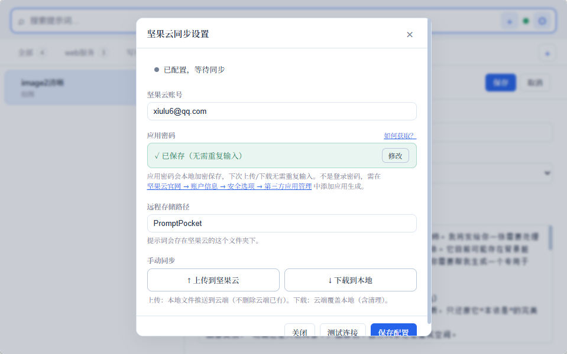

# Prompt Pocket

Prompt Pocket 是一个轻量级提示词管理桌面应用：用 `Ctrl+Alt+P` 从任意窗口唤出，搜索提示词，按 `Enter` 复制；如果唤出前焦点就在输入框里，还会自动把当前提示词粘贴回原输入框，同时同步到剪贴板。

官网 / GitHub Pages: https://techdou.github.io/prompt-pocket/


## 适合谁

- 经常在 ChatGPT、IDE、浏览器输入框、文档编辑器之间复用提示词的人。
- 想用本地 Markdown 文件管理提示词，而不是把数据交给第三方服务的人。
- 希望提示词工具像系统搜索一样：随叫随到，用完自动消失。

## 核心能力

| 能力 | 说明 |
| --- | --- |
| 全局秒唤 | `Ctrl+Alt+P` 从任意应用唤出 Prompt Pocket。 |
| 智能复制 / 粘贴 | `Enter` 会先写入剪贴板；如果唤出前焦点在文本输入框，会自动粘贴回原输入框。 |
| Markdown 存储 | 一条提示词一个 `.md` 文件，文件夹就是分类，便于备份、搜索和迁移。 |
| 键盘优先 | `Ctrl+F` 搜索、`↑` / `↓` 选择、`Enter` 复制，全流程可不碰鼠标。 |
| 手动云同步 | 通过坚果云 WebDAV 上传到云端或下载到本地，避免自动同步误覆盖。 |
| 轻量桌面壳 | Tauri v2 + Rust 后端，不使用 Electron。 |

## 使用流程

1. 在任意应用的输入框里放好光标。
2. 按 `Ctrl+Alt+P` 唤出 Prompt Pocket。
3. 搜索或用 `↑` / `↓` 选中提示词。
4. 按 `Enter`。

结果：

- 唤出前焦点在输入框：提示词写入剪贴板，并自动粘贴到原输入框。
- 唤出前焦点不在输入框：只写入剪贴板，不模拟粘贴。

这个判断在 Windows 上优先使用 UI Automation 识别现代输入框，失败时回退到传统 caret 检测。

## 界面

| 主界面 / 搜索 | 填空式编辑 |
| --- | --- |
|  |  |

| 长提示词编辑 | 坚果云同步 |
| --- | --- |
|  |  |

拖拽排序使用原生 Pointer Events。按住列表项左侧手柄即可重排；搜索结果和多分类「全部」视图会自动禁用排序，避免隐藏项错序。


## 快捷键

| 操作 | 快捷键 |
| --- | --- |
| 全局唤出 / 隐藏 | `Ctrl+Alt+P` |
| 新建提示词 | `Ctrl+N` |
| 聚焦搜索框 | `Ctrl+F` |
| 上下选择 | `↑` / `↓` |
| 复制选中项 | `Enter` |
| 隐藏窗口 | `Esc` |

## 数据格式

本地数据默认保存在：

```text
%APPDATA%/com.promptpocket.app/PromptPocket/
```

目录结构示例：

```text
PromptPocket/
├── 写作/
│   ├── 改写润色.md
│   └── 周报模板.md
└── 编程/
    └── 代码审查.md
```

每个提示词文件都是普通 Markdown：

```markdown
---
title: 改写润色
copy_mode: markdown
created: 2026-06-27T00:00:00Z
updated: 2026-06-27T00:00:00Z
---

请把下面这段文字改写得更简洁、专业：

> 待改写内容
```

## 坚果云同步

Prompt Pocket 通过 WebDAV 连接坚果云。

配置方式：

1. 登录坚果云，进入「账户信息 -> 安全选项 -> 第三方应用管理」。
2. 添加应用并生成应用密码。注意这不是登录密码。
3. 在 Prompt Pocket 的设置里填写账号、应用密码和远程目录。
4. 使用「上传到坚果云」或「下载到本地」手动同步。

同步策略：

- 上传：把本地提示词推送到云端，不删除云端已有文件。
- 下载：以云端为准拉取到本地，并清理云端已删除的本地文件。
- `.trash`、隐藏目录和 `.sync_meta.json` 会被过滤，避免备份或内部元数据混入列表。

## 开发

前置依赖：

- Node.js 18+
- Rust 1.77+
- Windows 打包需要 Tauri 所需的 WebView2 / Visual Studio Build Tools 环境

```bash
npm install
npm run tauri:dev
```

常用命令：

```bash
npm run build
npm run tauri:build
node --experimental-strip-types --test src/lib/reorder.test.mjs src/lib/api.test.mjs
cargo test --manifest-path src-tauri/Cargo.toml
```

## GitHub Pages

Pages 静态落地页位于 `docs/index.html`，截图资源位于 `docs/screenshots/`。

本地预览：

```powershell
cd docs
python -m http.server 8010
```

当前仓库的 GitHub Pages 配置为 `main` 分支的 `/docs` 目录；推送到 `main` 后，GitHub 会自动重新发布这个目录。

## 技术栈

| 层 | 技术 |
| --- | --- |
| 桌面 | Tauri v2 |
| 后端 | Rust |
| 前端 | Svelte 5 + Vite + TypeScript |
| 快捷键 | `tauri-plugin-global-shortcut` |
| 剪贴板 | `tauri-plugin-clipboard-manager` |
| 输入框识别 | Windows UI Automation + legacy caret fallback |
| 键盘注入 | `enigo` |
| 云同步 | `reqwest_dav` + 坚果云 WebDAV |
| 数据 | Markdown + YAML frontmatter |

## License

MIT
