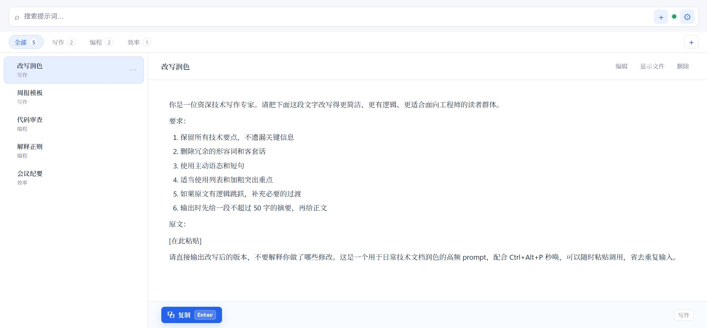
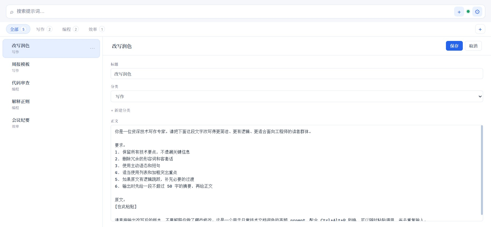
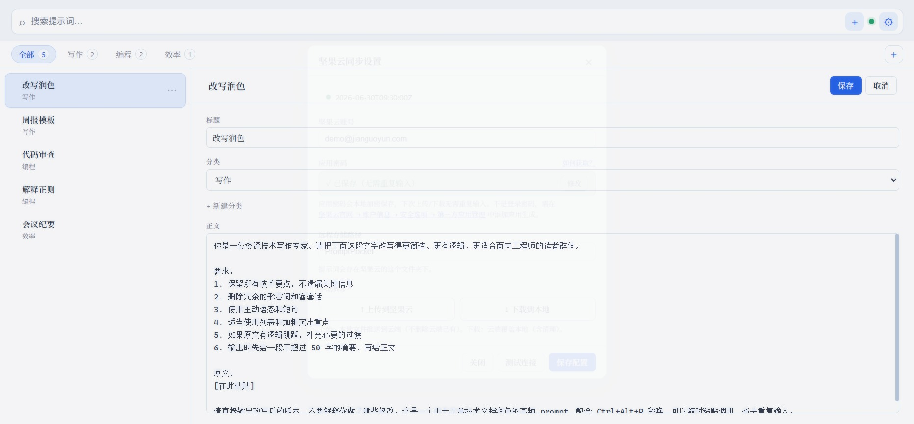
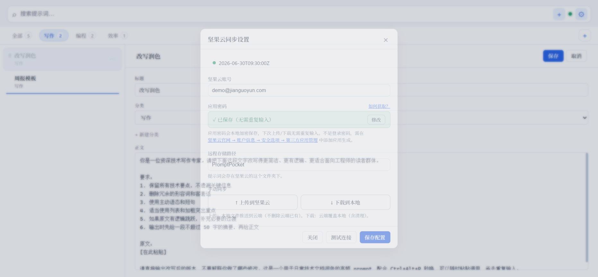

# Prompt Pocket

> 轻量级提示词管理工具 —— 全局快捷键秒唤，Markdown 存储，坚果云同步。

按 `Ctrl+Alt+P` 从任意应用唤出，搜索 → 选中 → `Enter` 复制，回到原应用粘贴即用。


## 特性

- ⚡ **秒唤秒用**：全局快捷键 `Ctrl+Alt+P` 随时唤出/隐藏 spotlight 窗口，失焦自动收起
- 🗂 **分类管理**：一 prompt 一 Markdown 文件，文件夹即分类，支持右键新建/重命名
- ☁️ **坚果云同步**：内置设置界面，填入坚果云账号 + 应用密码即可，启动自动拉取、保存自动推送
- 🔍 **模糊搜索**：标题 / 分类 / 正文实时检索，键盘全程可达
- ✍️ **填空式编辑**：标题/分类用表单填写，无需手写 YAML；Markdown 预览
- 🔀 **拖拽排序**：原生指针事件实现，按住列表项手柄拖到目标位置即可重排
- 🪶 **极致轻量**：Tauri + Rust 后端，安装包 1.6MB，内存约 42MB，CPU 近乎 0

## 界面一览

| 主界面 / 搜索 | 编辑（长内容也能完整看到复制按钮） |
|---|---|
|  |  |

| 填空式编辑表单 | 坚果云同步设置 |
|---|---|
|  |  |

按住列表项左侧的 ⠿ 手柄即可拖拽排序（搜索结果与「全部」多分类视图下自动禁用，避免隐藏项错序）：



## 坚果云同步

应用通过 **WebDAV 协议**直连坚果云，数据自动同步到所有设备。

### 配置步骤

1. **获取应用密码**：登录 [坚果云官网](https://www.jianguoyun.com) → 账户信息 → 安全选项 → 第三方应用管理 → 添加应用 → 生成**应用密码**（不是登录密码）
2. **应用内配置**：点顶栏 **⚙** → 填入坚果云账号 + 应用密码 → 点「测试连接」验证 → 「保存并同步」
3. 完成。此后启动自动拉取最新，编辑保存后自动推送

### 同步机制

- **本地缓存 + 后台同步**：所有读写走本地缓存（瞬间响应），后台异步与坚果云同步
- **启动拉取**：打开应用时静默从坚果云拉取最新到本地
- **保存即推**：编辑保存后立即推送单个文件到坚果云
- 规避坚果云速率限制（免费版每 30 分钟 600 次请求）

> 应用密码明文存储于 `%APPDATA%/com.promptpocket.app/config.json`，个人电脑可接受。

## 快捷键

| 操作 | 快捷键 |
|---|---|
| 全局唤出 / 隐藏 | `Ctrl+Alt+P` |
| 新建提示词 | `Ctrl+N` |
| 聚焦搜索框 | `Ctrl+F` |
| 上下选择 | `↑` / `↓` |
| 复制选中并隐藏 | `Enter` |
| 隐藏窗口 | `Esc` |
| 列表项右键 | 重命名 / 移动分类 / 删除 |
| 分类右键 | 重命名分类 |

## 技术栈

| 层 | 技术 | 说明 |
|---|---|---|
| 桌面框架 | [Tauri v2](https://tauri.app) | Rust 后端，跨平台原生 |
| 全局快捷键 | `tauri-plugin-global-shortcut` | 注册 Ctrl+Alt+P |
| 云同步 | `reqwest_dav` + 坚果云 WebDAV | 本地缓存 + 后台同步 |
| 前端 | Svelte 5 + Vite + TypeScript | 响应式 UI |
| 拖拽排序 | 原生 Pointer Events | 不依赖任何拖拽库 |
| 存储 | Markdown 文件 + YAML frontmatter | 无数据库 |

## 数据格式

本地缓存于 `%APPDATA%/com.promptpocket.app/PromptPocket/`，同步到坚果云 `PromptPocket/` 目录：

```
PromptPocket/
├── 写作/
│   ├── 改写润色.md
│   └── 周报模板.md
└── 编程/
    └── 代码审查.md
```

每个 `.md` 文件：

```markdown
---
title: 改写润色
copy_mode: markdown
created: 2026-06-27T00:00:00Z
updated: 2026-06-27T00:00:00Z
---

请把下面这段文字改写得更**简洁**…
```

## 开发

前置依赖：[Node.js](https://nodejs.org) 18+、[Rust](https://rustup.rs) 1.77+。

```bash
npm install
npm run tauri:dev    # 启动开发模式（热重载）
npm run tauri:build  # 打包发布版本
```

### 测试

拖拽排序的纯逻辑抽离在 `src/lib/reorder.ts`，配套 `src/lib/reorder.test.mjs` 单测；Rust 端 `.trash` 过滤与 WebDAV 遍历有 `#[test]` 覆盖。

```bash
# 前端拖拽逻辑单测（Node 需 strip TS）
node --experimental-strip-types --test src/lib/reorder.test.mjs

# Rust 单测
cargo test --manifest-path src-tauri/Cargo.toml
```

## 更新日志

### v1.0.6

- 🎨 **UI 视觉系统升级**：浅色主题 + 亮蓝聚焦色（`#2563eb`）、卡片化布局、统一圆角与柔和阴影
- 🔤 **分离字体栈**：西文（Segoe UI / Aptos）与中文（Noto Serif / Sans SC）分栈，混排更协调；代码用等宽字体
- 🐛 **修复长 prompt 挤掉复制按钮**：编辑器改为 header / 正文滚动区 / footer 三段固定布局，超长正文独立滚动，复制按钮始终可见
- 🔀 **真正修好拖拽排序**：弃用 `svelte-dnd-action`，改用原生 Pointer Events 自研实现，落点实时计算 + 指示线，并修掉同步事件把刚拖的顺序冲掉的竞态
- 🐛 **坚果云下载修复**：WebDAV 不支持 `Depth: Infinity`（静默降级为只返回一层），改为逐层递归遍历，确保多分类文件能完整拉取
- 🛡 **`.trash` 防泄漏**：本地扫描与远程遍历均过滤 `.trash` 及隐藏目录，备份文件不再混进列表

<details>
<summary>更早版本</summary>

- **v1.0.5**：上传校对升级为哈希 + 下载防误删
- **v1.0.4**：`.trash` 污染同步 + 上传重复修复 + 拖拽库引入
- **v1.0.3**：应用密码持久化 UX + 文件命名优化
- **v1.0.2**：拖拽排序 + 鲁棒性全面加固
- **v1.0.1**：同步改为纯手动（上传/下载二选一）
- **v1.0.0**：坚果云 WebDAV 同步

</details>

## License

MIT
