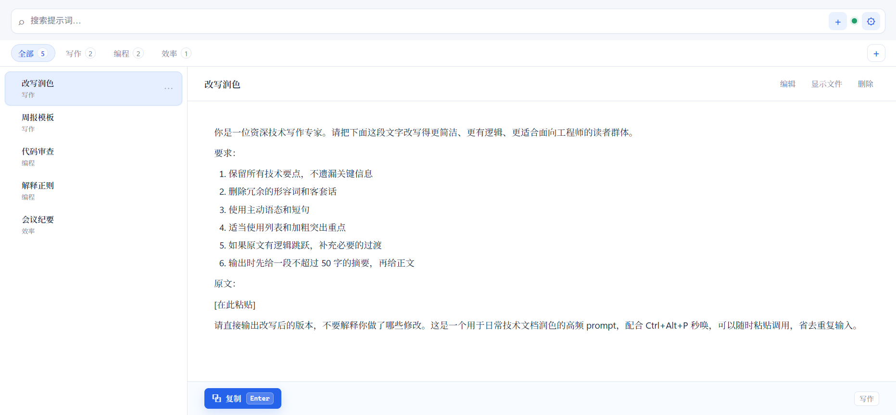

# Prompt Pocket

<p align="center">
  
</p>

<p align="center">
  <a href="https://github.com/techdou/prompt-pocket/releases/latest">
    
  </a>
  <a href="LICENSE">
    
  </a>
  
  
  <a href="https://github.com/techdou/prompt-pocket/actions/workflows/ci.yml">
    
  </a>
</p>

<p align="center">
  <a href="#简体中文">简体中文</a>
  ·
  <a href="#english">English</a>
  ·
  <a href="https://techdou.github.io/prompt-pocket/">Website</a>
  ·
  <a href="https://github.com/techdou/prompt-pocket/releases/latest">Download</a>
</p>

Prompt Pocket 是一个轻量级桌面提示词管理工具。`Ctrl+Alt+P` 从任意应用快速唤出，提示词以本地 Markdown 文件保存，支持通过坚果云 WebDAV 或 GitHub 仓库手动同步。

Prompt Pocket is a lightweight desktop prompt manager. Open it from anywhere with `Ctrl+Alt+P`, store prompts as local Markdown files, and sync manually through Jianguoyun WebDAV or a GitHub repository.

---

## 简体中文

### 功能特性

| 功能 | 说明 |
| --- | --- |
| 全局秒唤 | `Ctrl+Alt+P` 从任意应用唤出或隐藏，多屏下在鼠标所在屏居中 |
| 全文搜索 | `Ctrl+F` 同时匹配标题与正文；正文命中时列表显示上下文摘录 |
| 智能复制 / 粘贴 | `Enter` 写入剪贴板；唤出前焦点在输入框时自动粘贴（仅 Windows） |
| 双复制模式 | `markdown` 复制原文；`plain` 自动剥离 Markdown 标记后复制 |
| Markdown 存储 | 一条提示词一个 `.md` 文件，文件夹就是分类，文件名跟随标题 |
| 富 Markdown 预览 | GFM 表格、任务列表、代码块；Mermaid、KaTeX、highlight.js 全部本地内置、按需加载，无 CDN 依赖 |
| 提示词排序 | 单个分类内拖动列表项手柄，顺序写入 `.order.json` |
| 分类排序 | 横向拖动分类标签手柄，顺序写入 `.category-order.json` |
| 开机自启动 | 设置页一键开关，读写系统真实状态（注册表 / LaunchAgent） |
| 手动云同步 | 坚果云 WebDAV 或 GitHub 仓库存档二选一，上传 / 下载均由用户显式触发，避免自动同步误覆盖 |
| 安全凭据存储 | WebDAV 应用密码 / GitHub PAT 存系统凭据库，不落明文 JSON |
| 轻量桌面壳 | Tauri v2 + Rust 后端，无 Electron |

### 下载安装

从 [GitHub Releases](https://github.com/techdou/prompt-pocket/releases/latest) 下载最新版 `v2.1.0`，安装包由 GitHub Actions 三平台构建：

| 平台 | 文件 |
| --- | --- |
| macOS Apple Silicon | `Prompt.Pocket_2.1.0_aarch64.dmg` |
| Windows x64 | `Prompt.Pocket_2.1.0_x64_en-US.msi` |
| Linux x64 | `Prompt.Pocket_2.1.0_amd64.deb` |

安装包未做代码签名：Windows 首次运行可能弹 SmartScreen 警告（选「仍要运行」）；macOS 首次打开需右键 →「打开」绕过 Gatekeeper。

首次启动显示主窗口；之后默认隐藏到后台，用快捷键或托盘图标唤起。

### 快速开始

1. 在任意应用的输入框里放好光标。
2. 按 `Ctrl+Alt+P` 唤出 Prompt Pocket。
3. 搜索或用方向键选中提示词。
4. 按 `Enter`。

Windows 上唤出前焦点在输入框时，内容写入剪贴板后自动粘贴回原输入框；其他平台只写剪贴板，手动粘贴。

### 快捷键

| 操作 | 快捷键 |
| --- | --- |
| 全局唤出 / 隐藏 | `Ctrl+Alt+P` |
| 新建提示词 | `Ctrl+N` |
| 聚焦搜索框 | `Ctrl+F` |
| 上下选择 | `↑` / `↓` |
| 复制选中项 | `Enter` |
| 隐藏窗口 | `Esc` |

### 平台说明

- **自动粘贴仅 Windows 生效**：当前版本的 macOS / Linux 前台焦点检测尚未实现，即使唤出前焦点在输入框，也只写入剪贴板，请手动 `Cmd+V` / `Ctrl+V` 粘贴。
- **快捷键冲突**：`Ctrl+Alt+P` 若被其它软件占用，全局唤出会失效（应用会弹窗提示），请先在占用方里改键。当前版本快捷键为固定值。

### 数据结构

默认数据目录：

```text
Windows: %APPDATA%/com.promptpocket.app/PromptPocket/
macOS:   ~/Library/Application Support/com.promptpocket.app/PromptPocket/
Linux:   ~/.config/com.promptpocket.app/PromptPocket/
```

目录示例：

```text
PromptPocket/
├── 写作/
│   ├── 改写润色.md
│   └── 周报模板.md
├── 编程/
│   └── 代码审查.md
├── .order.json          # 每个分类内的提示词排序
└── .category-order.json # 分类排序
```

提示词文件格式（frontmatter 由应用规范读写，正文为任意 Markdown）：

```markdown
---
title: 改写润色
copy_mode: markdown
created: 2026-06-27T00:00:00Z
updated: 2026-06-27T00:00:00Z
---

请把下面这段文字改写得更简洁、专业：

> 待改写内容
```

删除的提示词会先备份到数据目录的 `.trash/` 再移除，误删可从那里找回。

### 拖拽排序

- 提示词排序只在单个分类视图可用；搜索结果和「全部」视图禁用排序。
- 分类排序中「全部」固定首位不可拖；其他分类可横向重排。
- 前端先乐观更新，再由 Rust 后端原子写入排序 JSON；拖拽期间挂起列表刷新，写盘完成后补刷，顺序不会被旧数据冲掉。

### Markdown 预览

- 离线内置 GitHub Flavored Markdown（GFM）：表格、引用、删除线、任务列表、代码块。
- Mermaid、KaTeX、highlight.js 本地打包、按需加载，无网络也可用。
- raw HTML 一律转义显示，危险协议的链接/图片被拦截；渲染失败降级显示源码。

### 云同步

同步后端二选一（设置页顶部切换），两侧配置各自独立保存、互不影响。

**坚果云 WebDAV**：

1. 登录坚果云，打开「账户信息 → 安全选项 → 第三方应用管理」。
2. 添加应用并生成应用密码。
3. 在 Prompt Pocket 设置中填写账号、应用密码和远程目录，可先「测试连接」。
4. 需要同步时显式点「上传」或「下载」。

**GitHub 仓库存档**：

1. 在 GitHub 创建一个仓库（建议私有；需已有至少一个提交，创建时勾选初始化 README 即可）。
2. 创建 fine-grained PAT（GitHub → Settings → Developer settings → Personal access tokens），只授权这一个仓库的 **Contents 读写**权限。
3. 在设置页切换到「GitHub 存档」，填写 `owner/repo`、PAT，可选分支（默认 `main`）与仓库内路径前缀（默认根目录），先「测试连接」再保存。
4. 同步操作与坚果云一致，每条提示词的变更在仓库里体现为独立提交。

同步规则（两种后端一致）：

- **上传**：以本地为准推送变更；本地删除过的文件会同步删除远端对应文件（删除传播）。
- **下载**：以远端为准拉取；本地已删除的文件不会被远端「复活」，被覆盖的本地旧文件自动备份到 `.trash/`。
- `.trash`、隐藏文件和同步元数据不参与同步；排序文件（`.order.json` / `.category-order.json`）随同步传输。
- 同步进行中编辑操作会被暂时拒绝，结束后自动恢复。
- 应用密码 / PAT 保存到系统凭据库；旧版本明文 JSON 中的密码会在读取时自动迁移出去。

### 开发

前置依赖：

- Node.js 22+
- Rust 1.77+
- Tauri v2 平台工具链：<https://v2.tauri.app/start/prerequisites/>

```bash
npm install
npm run tauri:dev    # 开发调试
npm run tauri:build  # 打包安装包
```

验证（提交前全绿）：

```bash
npm run check        # svelte-check + tsc
npm test             # 前端单测（node:test）
npm run build        # vite 构建
cargo test --manifest-path src-tauri/Cargo.toml
cargo clippy --manifest-path src-tauri/Cargo.toml --all-targets -- -D warnings
```

### 发布

- 打 `vX.Y.Z` tag 并推送触发 [release.yml](.github/workflows/release.yml)：发布前自动跑完整质量门（check / test / clippy），通过后三平台构建并上传 GitHub Release。
- GitHub Pages 落地页位于 `docs/`，推送到 `main` 后自动发布。

### 技术栈

| 层 | 技术 |
| --- | --- |
| 桌面壳 | Tauri v2 |
| 后端 | Rust |
| 前端 | Svelte 5 + Vite + TypeScript |
| Markdown | marked + marked-highlight |
| 富内容增强 | Mermaid / KaTeX / highlight.js 本地内置、按需加载 |
| 快捷键 / 剪贴板 / 托盘 / 单实例 / 自启动 | tauri-plugin-global-shortcut / clipboard-manager / tray icon / single-instance / autostart |
| 凭据存储 | keyring + 系统凭据库 |
| 云同步 | reqwest_dav（坚果云 WebDAV）/ GitHub Contents API |
| 数据格式 | Markdown + YAML frontmatter |

---

## English

Prompt Pocket is a lightweight desktop prompt manager: summon it from any app with `Ctrl+Alt+P`, keep prompts as local Markdown files, and sync on demand through Jianguoyun WebDAV or a GitHub repository.

### Features

| Feature | Description |
| --- | --- |
| Global launcher | Open or hide with `Ctrl+Alt+P`; centers on the monitor under the cursor |
| Full-text search | `Ctrl+F` matches titles and prompt bodies; body hits show a context excerpt |
| Smart copy / paste | `Enter` copies to clipboard; auto-pastes back when launched from a text input (Windows only) |
| Dual copy modes | `markdown` copies the source; `plain` strips Markdown syntax before copying |
| Markdown storage | One prompt per `.md` file; folders are categories; filenames follow titles |
| Rich preview | GFM tables, task lists, code blocks; Mermaid / KaTeX / highlight.js bundled locally, lazy-loaded, no CDN |
| Prompt ordering | Drag handles within one category; saved to `.order.json` |
| Category ordering | Drag category tabs horizontally; saved to `.category-order.json` |
| Launch at login | One toggle in Settings, backed by the real system state (registry / LaunchAgent) |
| Manual cloud sync | Jianguoyun WebDAV or GitHub repository archive; upload / download only when explicitly triggered |
| Secure credentials | App passwords / GitHub PATs live in the system credential store, never plaintext JSON |
| Lightweight shell | Tauri v2 + Rust backend, no Electron |

### Download

Grab the latest `v2.1.0` from [GitHub Releases](https://github.com/techdou/prompt-pocket/releases/latest):

| Platform | File |
| --- | --- |
| macOS Apple Silicon | `Prompt.Pocket_2.1.0_aarch64.dmg` |
| Windows x64 | `Prompt.Pocket_2.1.0_x64_en-US.msi` |
| Linux x64 | `Prompt.Pocket_2.1.0_amd64.deb` |

Installers are unsigned: Windows may show a SmartScreen warning (choose "Run anyway"); on macOS, right-click → Open to bypass Gatekeeper on first launch.

The first launch shows the main window; afterwards the app stays in the background, summoned via the hotkey or tray icon.

### Quick Start

1. Put the caret in any text input.
2. Press `Ctrl+Alt+P` to open Prompt Pocket.
3. Search or use arrow keys to select a prompt.
4. Press `Enter`.

On Windows the prompt is pasted back automatically when launched from a text input; on other platforms it is only copied — paste manually.

### Keyboard Shortcuts

| Action | Shortcut |
| --- | --- |
| Open / hide globally | `Ctrl+Alt+P` |
| Create prompt | `Ctrl+N` |
| Focus search | `Ctrl+F` |
| Move selection | `↑` / `↓` |
| Copy selected prompt | `Enter` |
| Hide window | `Esc` |

### Platform Notes

- **Auto-paste works on Windows only**: foreground focus detection is not yet implemented on macOS / Linux, so the prompt is only copied to the clipboard — paste manually with `Cmd+V` / `Ctrl+V`.
- **Hotkey conflicts**: if another app owns `Ctrl+Alt+P`, the global hotkey will not register (the app shows a warning dialog). The hotkey is fixed in this version.

### Data Layout

Default data directories:

```text
Windows: %APPDATA%/com.promptpocket.app/PromptPocket/
macOS:   ~/Library/Application Support/com.promptpocket.app/PromptPocket/
Linux:   ~/.config/com.promptpocket.app/PromptPocket/
```

Example:

```text
PromptPocket/
├── Writing/
│   ├── Rewrite.md
│   └── Weekly-report.md
├── Coding/
│   └── Code-review.md
├── .order.json          # prompt order inside each category
└── .category-order.json # category order
```

Prompt file format (frontmatter is read/written canonically by the app; the body is free-form Markdown):

```markdown
---
title: Rewrite
copy_mode: markdown
created: 2026-06-27T00:00:00Z
updated: 2026-06-27T00:00:00Z
---

Rewrite the following text to be concise and professional:

> Text to rewrite
```

Deleted prompts are backed up to `.trash/` inside the data directory before removal.

### Cloud Sync

Pick one sync backend (switch at the top of Settings); both configurations are kept independently.

**Jianguoyun WebDAV**:

1. Sign in to Jianguoyun, open "Account Info → Security Options → Third-party App Management".
2. Create an app password.
3. Enter the account, app password, and remote directory in Settings; "Test connection" first.
4. Click "Upload" or "Download" explicitly when you want to sync.

**GitHub repository archive**:

1. Create a GitHub repository (private recommended; it must have at least one commit — check "Initialize with README").
2. Create a fine-grained PAT (GitHub → Settings → Developer settings → Personal access tokens) with **Contents read/write** on that repository only.
3. Switch to "GitHub archive" in Settings, enter `owner/repo` and the PAT; optionally set a branch (default `main`) and a path prefix (default repo root). Test the connection, then save.
4. Sync works the same as WebDAV; each prompt change becomes its own commit in the repository.

Sync rules (identical for both backends):

- **Upload** treats local as the source of truth; files deleted locally are also deleted remotely (deletion propagation).
- **Download** treats remote as the source of truth; locally deleted files are not resurrected, and local files about to be overwritten are backed up to `.trash/` first.
- `.trash`, hidden files, and sync metadata are excluded; ordering files (`.order.json` / `.category-order.json`) travel with sync.
- Editing is briefly rejected while a sync is in flight.
- App passwords / PATs are stored in the system credential store; legacy plaintext JSON secrets are migrated on read.

### Development

Prerequisites:

- Node.js 22+
- Rust 1.77+
- Tauri v2 platform prerequisites: <https://v2.tauri.app/start/prerequisites/>

```bash
npm install
npm run tauri:dev    # dev session
npm run tauri:build  # package installers
```

Verification (all green before committing):

```bash
npm run check
npm test
npm run build
cargo test --manifest-path src-tauri/Cargo.toml
cargo clippy --manifest-path src-tauri/Cargo.toml --all-targets -- -D warnings
```

### Publishing

- Push a `vX.Y.Z` tag to trigger [release.yml](.github/workflows/release.yml): a full quality gate (check / test / clippy) runs first, then installers are built and uploaded to GitHub Release for all three platforms.
- The GitHub Pages landing page lives in `docs/` and republishes on pushes to `main`.

## License

[Apache License 2.0](LICENSE)
