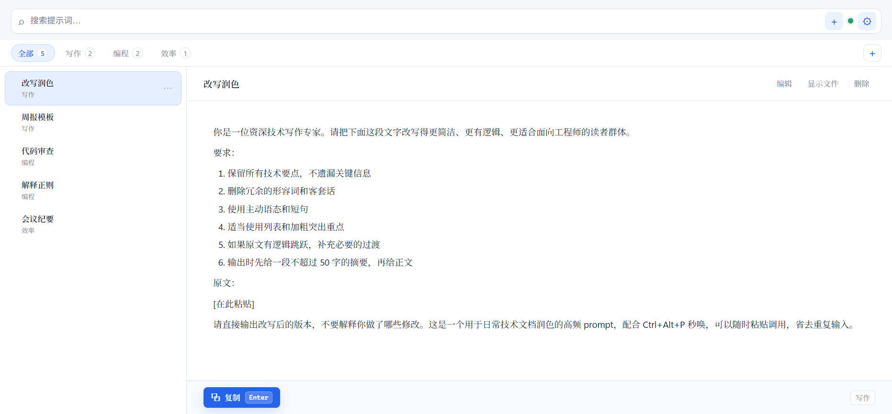
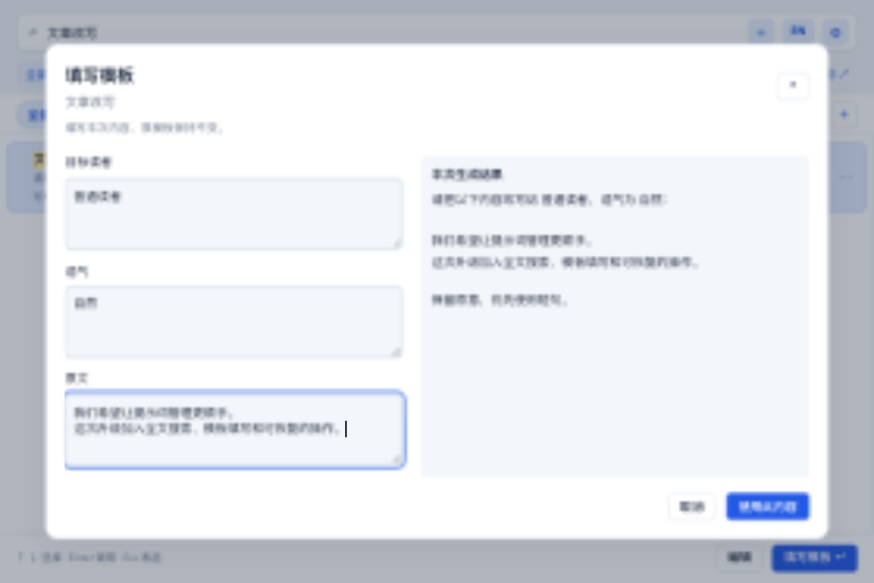

# Prompt Pocket

<p align="center">
  
</p>

Prompt Pocket 是一个轻量级桌面提示词管理工具。它像系统搜索一样用全局快捷键秒唤，把提示词保存在本地 Markdown 文件里，并提供搜索、收藏、最近使用、模板填空、排序、恢复记录和手动 WebDAV 同步。

官网：<https://techdou.github.io/prompt-pocket/>

## 适合谁

- 经常在 ChatGPT、浏览器、IDE、文档编辑器之间复用提示词的人
- 想把提示词保存为本地 Markdown 文件，而不是交给第三方服务的人
- 想要一个随叫随到、用完自动隐藏的提示词口袋的人
- 希望云同步可控、冲突可见，而不是自动覆盖本地内容的人

## 核心特性

| 能力 | 说明 |
| --- | --- |
| 双视图 | 快速调用视图使用紧凑列表；整理提示词视图展开分类、预览、编辑和设置 |
| 自定义全局快捷键 | 默认 `Ctrl+Alt+P`，可在设置中修改；修改失败会保留原快捷键 |
| 智能复制 / 粘贴 | Windows 会在确认原输入框仍聚焦时尝试自动粘贴；macOS / Linux 只复制到剪贴板 |
| 全文搜索 | 标题和正文一起检索，列表展示正文命中片段并高亮关键词 |
| 收藏与最近使用 | 可收藏常用提示词；复制成功后记录最近使用，本地偏好不会云同步 |
| Markdown 存储 | 一条提示词一个 `.md` 文件，文件夹就是分类 |
| 模板变量 | 支持 `{{name}}`、`{{name|default}}`，用 `\{{name}}` 保留字面量 |
| 编辑保护 | 加载、保存、复制和未保存编辑期间会限制容易丢数据的操作 |
| 恢复记录 | 保存、重命名、删除和同步覆盖前写入本地 `.recovery`；恢复时不覆盖现有文件 |
| 提示词排序 | 在单个分类里拖动列表项左侧手柄，顺序写入 `.order.json` |
| 分类排序 | 横向拖动分类标签手柄，顺序写入 `.category-order.json` |
| 手动 WebDAV 同步 | 通过坚果云上传 / 下载；保守处理冲突，避免静默覆盖 |
| 安全凭据存储 | WebDAV 应用密码保存到系统凭据库，不写入明文 JSON |
| 托盘与单实例 | 快捷键被占用时仍可从托盘打开；重复启动会唤醒已有窗口 |
| 轻量桌面壳 | Tauri v2 + Rust 后端，不使用 Electron |

## 安装

从 GitHub Releases 下载 Windows 安装包：

- `Prompt Pocket_2.0.2_x64-setup.exe`：推荐，普通安装器
- `Prompt Pocket_2.0.2_x64_en-US.msi`：MSI 安装包
- `prompt-pocket.exe`：release 构建出的可执行文件

首次启动会显示主窗口；之后默认隐藏到后台，可用快捷键或托盘打开。

## 快速使用

1. 按全局快捷键唤出 Prompt Pocket，默认是 `Ctrl+Alt+P`
2. 在快速调用视图里搜索，也可以切到「收藏」或「最近使用」
3. 用方向键选择提示词，按 `Enter` 复制
4. 如果提示词包含模板变量，会先打开填写窗口；确认后再复制生成结果

复制结果：

- Windows：如果唤出前焦点在输入框，且返回时仍是同一个窗口/进程里的文本输入框，Prompt Pocket 会写入剪贴板并发送粘贴；否则只写入剪贴板
- macOS / Linux：当前实现只写入剪贴板，需要手动粘贴

Windows 上输入框识别优先使用 UI Automation（用户界面自动化）识别现代输入框，失败时回退到传统 caret（文本光标）检测。自动粘贴失败时，文本仍会留在剪贴板里。

## 两种视图

Prompt Pocket 有两个工作状态：

- 快速调用：紧凑窗口，适合搜索、收藏/最近使用筛选、键盘选择和一键复制
- 整理提示词：较大窗口，适合编辑正文和元数据、调整分类、创建副本、插入已有提示词片段、管理同步与恢复记录

从快速调用进入编辑会切到整理提示词视图。存在未保存编辑时，切换提示词、切换视图或退出编辑会要求确认；加载或保存未完成时不能复制。

## 快捷键

| 操作 | 快捷键 |
| --- | --- |
| 全局唤出 / 隐藏 | 默认 `Ctrl+Alt+P`，可在设置中修改 |
| 新建提示词 | `Ctrl+N` |
| 保存编辑 | `Ctrl+S` |
| 聚焦搜索框 | `Ctrl+F` |
| 上下选择 | `↑` / `↓` |
| 复制选中项 | `Enter` |
| 隐藏窗口 | `Esc` |

## 模板变量

提示词正文可以写模板占位符。复制前会弹出填写窗口，本次生成的文本用于复制，原模板文件不会被改写。

```markdown
请帮我把下面内容改写成{{语气|自然}}风格，面向{{读者}}：

{{原文}}
```

规则：

- `{{name}}`：必填变量，填写为空时不能应用
- `{{name|default}}`：带默认值的变量，可以直接使用默认值
- 重复变量只填写一次
- `\{{name}}`：转义后输出字面量 `{{name}}`
- 变量值按原样插入，不会递归解析其中的新模板语法

<p align="center">
  
</p>

## 数据结构

默认数据目录：

```text
Windows: %APPDATA%/com.promptpocket.app/PromptPocket/
macOS:   ~/Library/Application Support/com.promptpocket.app/PromptPocket/
Linux:   ~/.config/com.promptpocket.app/PromptPocket/
```

目录示例：

```text
PromptPocket/
├── 写作/
│   ├── 改写润色.md
│   └── 周报模板.md
├── 编程/
│   └── 代码审查.md
├── .order.json          # 每个分类内的提示词排序
├── .category-order.json # 分类排序
├── .sync_meta.json      # 本机同步基线，不上传
└── .recovery/           # 本机恢复记录，不上传
```

提示词文件格式：

```markdown
---
title: 改写润色
copy_mode: markdown
created: 2026-06-27T00:00:00Z
updated: 2026-06-27T00:00:00Z
---

请把下面这段文字改写得更简洁、专业：

> 待改写内容
```

说明：

- `copy_mode: markdown` 会按 Markdown 原文复制；`copy_mode: plain` 会复制渲染后的纯文本
- 文件夹名就是分类名；根目录下的 `.md` 文件显示为「未分类」
- 收藏、最近使用、快捷键、云同步配置等是本地偏好，不作为提示词内容同步到云端

## 拖拽排序

提示词排序和分类排序都使用 Pointer Events（指针事件），不依赖浏览器原生 Drag and Drop（拖放 API）。原因很简单：Tauri/WebView2 里原生拖放容易被桌面壳、窗口拖动和系统事件链路干扰。

- 提示词排序：只在单个分类视图可用，搜索结果、收藏、最近使用和多分类「全部」视图会禁用排序
- 分类排序：「全部」固定首位不可拖，其他分类可横向重排
- 写盘策略：前端先乐观更新，再调用 Rust 后端写入排序 JSON
- 同步范围：`.order.json` 和 `.category-order.json` 会参与 WebDAV 同步；`.sync_meta.json` 不同步

## 恢复记录

Prompt Pocket 会在风险操作前写入本地恢复记录：

- 保存或重命名现有提示词前，记录旧内容为 `history`
- 删除提示词前，记录被删除内容为 `deleted`
- 手动下载同步覆盖本地文件前，记录旧内容为 `sync`

恢复记录存放在本机数据目录的 `.recovery/`，不会上传到 WebDAV。设置页会显示最近最多 50 条记录，可以预览备份文本并恢复。恢复时如果原路径已经有文件，会生成一个带「恢复副本」后缀的新文件，不会覆盖现有内容。

## 富 Markdown 预览

预览分两层：

- 离线内置：GitHub Flavored Markdown（GFM），包括表格、引用、删除线、任务列表、代码块
- 联网增强：检测到对应语法时，按需从 CDN 加载 Mermaid、KaTeX、highlight.js

安全处理：

- raw HTML 一律转义显示
- `javascript:` 等危险链接会替换为 `#`
- Mermaid / KaTeX 占位元素会分别做文本转义和属性转义，避免属性注入
- CDN 加载失败时降级显示源码，不影响核心阅读和复制

## 坚果云同步

Prompt Pocket 通过坚果云 WebDAV 手动同步。同步不会自动后台运行，需要在设置中点击上传或下载。

配置步骤：

1. 登录坚果云
2. 打开「账户信息 → 安全选项 → 第三方应用管理」
3. 添加应用并生成应用密码
4. 在 Prompt Pocket 设置中填写账号、应用密码和远程目录
5. 选择「上传到坚果云」或「下载到本地」

同步规则：

- 上传：把本地提示词和两个排序文件推送到云端；如果远程文件与本地同步基线不一致，会保留冲突，不直接覆盖
- 下载：依据同步基线拉取远程更新；如果本地文件也改过，会保留本地内容，并把远程版本保存为 `.remote-conflict-...` 副本
- 远程删除不会直接清理本地文件；本地独有或本地已修改的提示词会保留，必要时在状态里报告冲突或失败
- 同步覆盖本地文件前会写入 `.recovery` 快照；快照失败则不会覆盖原文件
- 同步只处理普通提示词文件、分类目录、`.order.json` 和 `.category-order.json`；冲突副本、隐藏维护目录、符号链接、`.sync_meta.json`、`.recovery/` 不同步
- 应用密码保存到系统凭据库；旧版本明文 JSON 中的密码会在读取时迁移出去

设置页会展示最近一次同步结果和失败原因。成功处理的文件不会因为单个失败而被回滚。

## 开发

前置依赖：

- Node.js 22.6 或更高版本
- 当前 stable Rust 工具链（本次本地验证使用 Rust 1.94）
- Tauri v2 平台工具链：<https://v2.tauri.app/start/prerequisites/>

安装依赖：

```bash
npm ci
```

浏览器样例预览（不调用真实系统能力，适合看 UI）：

```bash
npm run dev -- --host 127.0.0.1
# 打开 Vite 输出的地址，并追加 ?preview
# 本项目为 http://127.0.0.1:1420/?preview
```

桌面开发运行：

```bash
npm run tauri:dev
```

生产构建：

```bash
npm run tauri:build
```

## 验证命令

前端常规验证：

```bash
npm run verify
```

Rust 验证可按需运行：

```bash
cargo test --manifest-path src-tauri/Cargo.toml
cargo clippy --manifest-path src-tauri/Cargo.toml --all-targets -- -D warnings
```

推送和拉取请求会触发 macOS、Windows 双平台检查。自动化配置见 `.github/workflows/verify.yml`；本次本地验证记录见 [升级验收记录](docs/upgrade/verification.md)。

## GitHub Pages

落地页位于 `docs/index.html`，截图资源位于 `docs/screenshots/`。

GitHub Pages 配置为 `main` 分支的 `/docs` 目录。推送到 `main` 后，Pages 会按仓库配置重新发布。

本地预览：

```bash
cd docs
python -m http.server 8010
```

## 技术栈

| 层 | 技术 |
| --- | --- |
| 桌面壳 | Tauri v2 |
| 后端 | Rust |
| 前端 | Svelte 5 + Vite + TypeScript |
| Markdown | marked + marked-highlight |
| 富内容增强 | Mermaid / KaTeX / highlight.js CDN 按需加载 |
| 快捷键 | tauri-plugin-global-shortcut |
| 剪贴板 | tauri-plugin-clipboard-manager |
| 托盘 | Tauri tray icon |
| 单实例 | tauri-plugin-single-instance |
| 凭据存储 | keyring + 系统凭据库 |
| 云同步 | reqwest_dav + 坚果云 WebDAV |
| 数据格式 | Markdown + YAML frontmatter |

## License

[Apache License 2.0](LICENSE)
